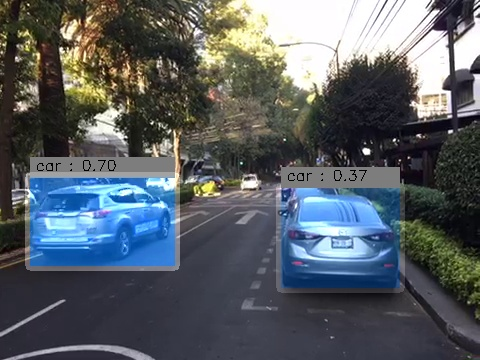

# Vehicle Detection(tiny YOLO and samll YOLO)

     
    <b>result image</b> 

## Introduction  
  
>This is **Vehicle Detection project** of Udacity's Self-Driving Car Engineering Nanodegree.
In YOLO approach, YOLO applies a single neural network to the full image.
  
## Environment  
  
#### software  
  
>Windows 10/Ubuntu (x64), Python 3.5/2.7, OpenCV 3.1.0

#### hardware  
  
>CPU : i5-6500 3.20GHz, GPU : GTX 980Ti, Memory : 8GB  

#### Files

[`main.py`](main.py) : main code
[`yolo_small.py`](yolo_small.py) : yolo model composition  
[`yolo_tiny.py`](yolo_tiny.py) : tiny yolo model composition  

### YOLO  

Yolo's approach is really impressive. Prior detection systems(e.g. faster-R-CNN) apply the model to an image at multiple locations and scales. High scoring regions of the image are considered detections. but YOLO applies a single neural network to the full image. This network divides the image into regions and predicts bounding boxes and probabilities for each region. These bounding boxes are weighted by the predicted probabilities.  
To understand how yolo works, please watch this [youtube video](https://www.youtube.com/watch?v=L0tzmv--CGY). Language is Russian but you can understand easily.
I referenced a [tensorflow version of YOLO](https://github.com/gliese581gg/YOLO_tensorflow).
Also the weight files can be downloaded from here:

YOLO_small : https://drive.google.com/file/d/0B2JbaJSrWLpza08yS2FSUnV2dlE/view?usp=sharing

YOLO_tiny : https://drive.google.com/file/d/0B2JbaJSrWLpza0FtQlc3ejhMTTA/view?usp=sharing

YOLO_face : https://drive.google.com/file/d/0B2JbaJSrWLpzMzR5eURGN2dMTk0/view?usp=sharing
